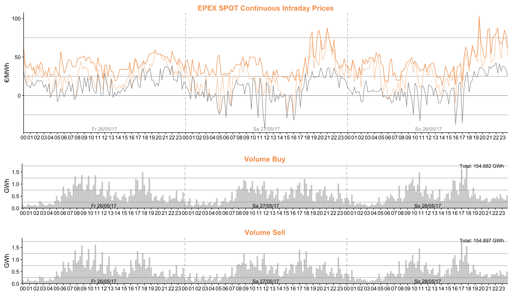

# emarketcrawlR <br/> – The R package for crawling data of the european energy market (EPEX SPOT) - 


## Goal

This R package provides functions to crawl the european energy market EPEX SPOT in Paris at https://www.epexspot.com
There are three trading auctions:
 - Intraday Continuous Trading at EPEX SPOT
 - Intraday Auction at EPEX SPOT
 - Day-Ahead Auction at EPEX SPOT

For all auctions, except the Intraday Auction (only german), french, german and swiss market data is available. The crawiling functions for this trading auctions return price data (in €/MWh) and volume (MWh) as well as different block prices for that day, especially base and peak load prices.

## Get Started

### Installing

When installing this package you should at least use the *R version 3.3.0 (2016-05-03)*. For the library dependecies see the section below. You can easily install this R package by using the `install_github()` function from the `devtools` package:

```r
library(devtools)
install_github("wagnertimo/emarketcrawlR")
```
### Library dependencies

Before using this R package, please check that you have installed the following R packages. Normally during the installation of the package those dependencies will also be installed. If not you have to do it manually.

- `httr`
- `xml2`
- `XML`
- `lubridate`
- `dplyr`
- `logging`
- `scales`
- `grid`
- `gridExtra`


### Usage

#### 1. Continuous Intraday Trading at EPEX SPOT

The function `getIntradayContinuousEPEXSPOT()` retrieves the continuous intraday trading data of the EPEX SPOT in Paris. Therefore it crawls the website https://www.epexspot.com/en/market-data/intradaycontinuous/intraday-table/. You can specify a time period in the format YYYY-MM-DD, a trading product (the time in minutes 60, 30, 15) and the country ("DE", "FR", "CH"). The returned data.frame contains information about the Low(€/MWh), High(€/MWh), Last(€/MWh), Weighted Avg.(€/MWh), Index(€/MWh), ID3(€/MWh, only for German Market), Buy and Sell Volume(MW) as well as the Base and Peak Load(€/MWh).

A big disadvantage of the function is, that the website of EPEX SPOT only provides information of two days on one site. Hence a request to retrieve a longer time period of data can take awhile since the function has to make a request for every two days within that time interval.

```r
# Set Logging to print out the state of process including a progress bar
setLogging(TRUE)

# Get the 15min (default: hour data) trading price data in the given time period of the german cont. intra. at EPEX SPOT
prices <- getIntradayContinuousEPEXSPOT("2017-05-20", "2017-05-26", "15", "DE")

head(prices)
# Output:
#              DateTime  Low High Last Weighted_Avg   Idx   ID3 Buy_Vol Sell_Vol Index_Base Index_Peak
# 1 2017-05-20 00:00:00 17.5 35.0 24.0        25.74 25.74 25.58   329.8    420.8      21.22      18.82
# 2 2017-05-20 00:15:00 -1.2 32.0 32.0        20.48 20.48 20.48   264.5    286.5      21.22      18.82
# 3 2017-05-20 00:30:00 -3.7 33.0 28.0        21.85 21.85 21.85   347.5    347.5      21.22      18.82
# 4 2017-05-20 00:45:00 12.8 32.0 30.0        24.90 24.90 24.91   510.1    510.1      21.22      18.82
# 5 2017-05-20 01:00:00 15.0 31.8 29.5        23.19 23.19 23.17   292.7    292.7      21.22      18.82
# 6 2017-05-20 01:15:00  2.8 25.0 13.7        10.75 10.75 10.69   220.4    220.4      21.22      18.82

```

** Plotting Continuous Intraday Trading data **

The package has a built-in function for a quick plot to visualize the price (Low, High, Last in €/MWh) and volume (buy and sell in GWh) data. The function does not return a plot object since it uses `grid.arrange`. The plot is directly outputted. The plot contains heavy graphic elements. Therfore it is not appropriate to use it for a large time period.

```r
# Get new data. Just a three days
lastPrices <- getIntradayContinuousEPEXSPOT("2017-05-26", "2017-05-28", "15", "DE")

qplotIntradayContinuous(lastPrices)
```



#### 2. Intraday Auction at EPEX SPOT

The function `getIntradayAuctionEPEXSPOT()` retrieves the intraday auction data of the EPEX SPOT in Paris. Therefore it crawls the website https://www.epexspot.com/en/market-data/intradayauction/quarter-auction-table/. You can specify a time period in the format YYYY-MM-DD. This kind of auction is only available for the german market. The returned data contains the intraday auction prices (15min base) and its volume as well as the block prices, especially the base and peak prices and volumes.

On the website are the last past six days of the requested date given. This allows to crawl 7 days of data with one request (this is a bit more than in the case of the `getIntradayContinuousEPEXSPOT()` function). Keep in mind that larger time frames will take awhile.

The blocks are defined as follows:
- Off-Peak (00-00 & 07-00 & 20-00 & 23-00) 
- Baseload Price with Volume (00-00 & 23-00) 
- Off-Peak 1 (00-00 & 07-00) 
- Peakload Price with Volume (08-00 & 19-00)
- Sun Peak (10-00 & 15-00) 
- Off-Peak 2 (20-00 & 23-00) 

```r
# Set Logging to print out the state of process including a progress bar
setLogging(TRUE)

# Get the 15min auction price data in the given time period of the german intra. auction market at EPEX SPOT. 
auctionPrices <- getIntradayAuctionEPEXSPOT("2017-05-19", "2017-05-26")

head(auctionPrices)
# Output:
#              DateTime Prices Volume OffPeak OffPeak1 SunPeak OffPeak2 BasePrice BaseVolume PeakPrice PeakVolume
# 1 2017-05-19 00:00:00  34.28  694.7   30.42    27.78   37.28     35.7     33.88      53489     37.33    27486.8
# 2 2017-05-19 00:15:00  30.59  291.1   30.42    27.78   37.28     35.7     33.88      53489     37.33    27486.8
# 3 2017-05-19 00:30:00  28.75  276.8   30.42    27.78   37.28     35.7     33.88      53489     37.33    27486.8
# 4 2017-05-19 00:45:00  23.50  546.1   30.42    27.78   37.28     35.7     33.88      53489     37.33    27486.8
# 5 2017-05-19 01:00:00  31.32  528.1   30.42    27.78   37.28     35.7     33.88      53489     37.33    27486.8
# 6 2017-05-19 01:15:00  26.95  185.7   30.42    27.78   37.28     35.7     33.88      53489     37.33    27486.8

```


#### 3. Day-Ahead-Auction at EPEX SPOT

The function `getDayAheadAuctionEPEXSPOT()` retrieves the day-ahead auction data of the EPEX SPOT in Paris. Therefore it crawls the website https://www.epexspot.com/en/market-data/dayaheadauction/auction-table/. You can specify a time period in the format YYYY-MM-DD and french ("FR"), german ("DE") or swiss ("CH") market data. The returned data contains the auction prices and its volume as well as the block prices, especially the base and peak prices and volumes.

The blocks are defined as follows:
- Middle Night (01-04)
- Early Morning (05-08) 
- Late Morning (09-12) 	
- Early Afternoon (13-16) 	
- Rush Hour (17-20) 	
- Off-Peak 2 (21-24) 	
- Baseload (01-24) 
- Peakload (09-20) 	
- Night (01-06) 	
- Off-Peak 1 (01-08) 	
- Business (09-16) 	
- Off-Peak (01-08 & 21-24) 	
- Morning (07-10) 
- High Noon (11-14) 
- Afternoon (15-18) 
- Evening (19-24) 	
- Sun Peak (11-16) 

```r
# Set Logging to print out the state of process including a progress bar
setLogging(TRUE)

# Get the hourly day-ahead auction price data in the given time period of the french auction market at EPEX SPOT. 
auction <- getDayAheadAuctionEPEXSPOT("2017-05-26", "2017-05-28", "FR")

head(auction)
# Output:
#              DateTime Prices  Volume MiddleNight EarlyMorning LateMorning EarlyAfternoon RushHour OffPeak2 Night OffPeak1 Business OffPeak
# 1 2017-05-26 00:00:00  28.38 11792.9       25.68        30.65       35.47          28.58    36.05    38.09 32.42    33.37    25.57   28.16
# 2 2017-05-26 01:00:00  25.71 11414.8       25.68        30.65       35.47          28.58    36.05    38.09 32.42    33.37    25.57   28.16
# 3 2017-05-26 02:00:00  24.65 11339.5       25.68        30.65       35.47          28.58    36.05    38.09 32.42    33.37    25.57   28.16
# 4 2017-05-26 03:00:00  23.96 11580.9       25.68        30.65       35.47          28.58    36.05    38.09 32.42    33.37    25.57   28.16
# 5 2017-05-26 04:00:00  24.33 12430.2       25.68        30.65       35.47          28.58    36.05    38.09 32.42    33.37    25.57   28.16
# 6 2017-05-26 05:00:00  26.39 12424.9       25.68        30.65       35.47          28.58    36.05    38.09 32.42    33.37    25.57   28.16
#    Morning HighNoon Afternoon Evening SunPeak BasePrice BaseVolume PeakPrice PeakVolume
# 1   32.02    31.47     36.66   31.62   29.58     32.42   331828.5     33.37   179938.8
# 2   32.02    31.47     36.66   31.62   29.58     32.42   331828.5     33.37   179938.8
# 3   32.02    31.47     36.66   31.62   29.58     32.42   331828.5     33.37   179938.8
# 4   32.02    31.47     36.66   31.62   29.58     32.42   331828.5     33.37   179938.8
# 5   32.02    31.47     36.66   31.62   29.58     32.42   331828.5     33.37   179938.8
# 6   32.02    31.47     36.66   31.62   29.58     32.42   331828.5     33.37   179938.8

```


